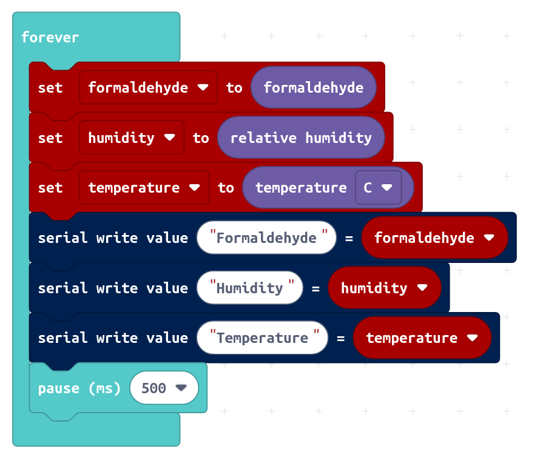

# Sensirion SFA30 Makecode Extension

Makecode extension for the Sensirion SFA30 evaluation kit connected to the micro:bit platform.

This extension allows you to read formaldehyde, temperature and relative humidity values with an interval of 0.5 second.


## SFA30 Evaluation Kit

[<center></center>](https://www.sensirion.com/en/environmental-sensors/evaluation-kit-sek-environmental-sensing/evaluation-kit-sek-sfa30/)

* Additional information:
[SFA30 Product Homepage](https://www.sensirion.com/en/environmental-sensors/evaluation-kit-sek-environmental-sensing/evaluation-kit-sek-sfa30/)
* Where to Buy: [Buy SFA30 Evaluation Kit](https://www.sensirion.com/index.php?id=1161&L=5&url=%22https://dilp.netcomponents.com/cgi-bin/sensirion.asp?lang=de&Region=NA&mode=2&partnumber1=SFA30&pq=Suchen%22)


## Supported Targets


* PXT/microbit
* Calliope mini

## I2C Address

* 0x5D

## Usage

open your microbit makecode project, in "+ Extension", paste the following URL:

https://github.com/Sensirion/makecode-extension-sfa30

## Demo



## API

Get formaldehyde value in ppb (parts per billion)
```ts
function get_formaldehyde()
```

Get temperature in degree celsius. Takes an optional argument to change to fahrenheit.
```ts
function get_temperature()
```

Get relative humidity in percent
```ts
function get_relative_humidity()
```

Start measurement on SFA30 evaluation kit. This method will be automatically called on initialization.
If you call `stop_continuous_measurement()` you have to call this method again before formaldehyde, temperature and humidity
values can be retrieved again.
```ts
function start_continuous_measurement()
```

Stop measurement on SFA30 evaluation kit. After calling this function, no more sensor values can be read out
anymore until you call `start_continuous_measurement`
```ts
function stop_continuous_measurement()
```


## License

[MIT](LICENSE)

Copyright (c) 2021, Sensirion AG

